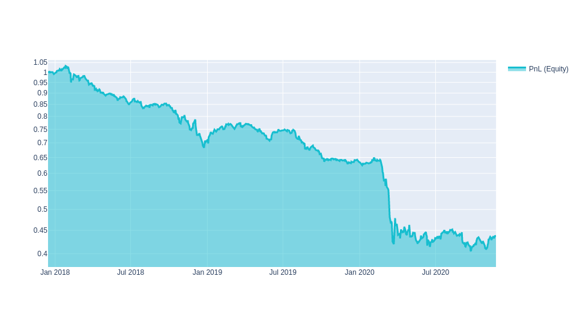

## About the platform

**Quantiacs** — a company that develops tools for creating trading strategies.

> We **offer** users
* win a cash prize by participating in <a href='/contest' target='_blank'>competition</a>.
* test financial ideas. You can apply them for private trade.

> We provide:
* development environment **Jupyter Notebook** or **JupyterLab**.
* Instances up to 8 GB of RAM for each strategy;.
* <a href='https://github.com/qntnet/data-relay' target='_blank'>open tools</a> for downloading **data** from financial **exchanges**.
* <a href='https://github.com/qntnet/qnt-python' target='_blank'>open tools</a> for **creating** trading **strategies**.
* examples of strategies.

<p class="tip">The necessary conditions</p>

* <a class="tip" href='/personalpage/registration' target='_blank'>Register on the platform</a>
* <a class="tip" href='/personalpage/strategies' target='_blank'>Open the strategy development tab</a>
* Click "create strategy" or "copy" any template of ready-made articles.

Below are the main steps involved in most strategies.


## Building strategies

### Example for stocks


> Strategy idea. The current day's price minus the previous day's price for the top 500 liquid instruments. We take the resulting changes as the weights of assets in the portfolio.

```python
import qnt.data as qndata
import qnt.stats as qnstats
import qnt.output as output

data = qndata.stocks.load_data(tail=6 * 365)

price_open = data.sel(field="open")
price_open_one_day_ago = price_open.shift(time=1)

strategy = price_open - price_open_one_day_ago

weights = strategy * data.sel(field="is_liquid")
weights = weights / abs(strategy).sum('asset')
weights = output.clean(weights, data, "stocks")

statistics = qnstats.calc_stat(data, weights)
output.check(weights, data, "stocks")

output.write(weights)
```


### Example for futures


> Strategy idea. The current day's price minus the previous day's price for futures. We take the resulting changes as the weights of assets in the portfolio.

```python
import qnt.data as qndata
import qnt.stats as qnstats
import qnt.output as output
import qnt.ta as qnta

futures = qndata.stocks.load_data(tail=8 * 365)

price_open = futures.sel(field="open")
price_open_one_day_ago = qnta.shift(price_open, periods=1)

strategy = price_open - price_open_one_day_ago

weights = strategy / abs(strategy).sum('asset')

statistics = qnstats.calc_stat(futures, weights)
output.check(weights, futures, "futures")

output.write(weights)
```

### 1. Preparations

At first one needs to prepare the workspace - load data and libraries

```python
import qnt.data as qndata
import qnt.stats as qnstats
import qnt.output as output
import qnt.ta as qnta

data = qndata.stocks.load_data(tail=6 * 365)
```

**data** is xarray.DataArray that contains **stocks historical data** for the last 6 * 365 days. 
The table of available data can be viewed here.

Get opening prices for today and yesterday:

```python
price_open = data.sel(field="open")
price_open_one_day_ago = qnta.shift(price_open, periods=1)
```

### 2. Weights allocation
> The trading algorithm uses financial data to form the weights, in proportion to which the capital is distributed. 

A **positive** weight means a long position (**buy**), a **negative** value means a short position (**sell**).

<p class="tip">For each date, the algorithm calculates what portfolio weights should be at the opening of the next day's trading.</p>

We will distribute the capital as the **difference** between **prices** for today and yesterday:
```python
strategy = price_open - price_open_one_day_ago
```
We will trade the top 500 **liquid companies**:

```python
weights = strategy * data.sel(field="is_liquid")
```
**data.sel(field = “is_liquid“)** is xarray.DataArray. A value of **1** on a particular day for a particular company means that the stock has been **in the top 500 liquid stocks** for the last full month.

We **normalize** % of capital for all companies:
```python
weights = weights / abs(strategy).sum('asset')
```
Let's try to **remove** the main financial **risks** from the strategy. The function includes **exposure** correction, **neutralization**.
```python
weights = output.clean(weights, data, "stocks")
```
### 3. Performance estimation
After we have built the algorithm, we need to evaluate it. First, we need to **calculate statistics**.

```python
statistics = qnstats.calc_stat(data, weights)
display(statistics.to_pandas().tail())
```

Algorithm results, calculated on historical data, are usually presented on an equity graph in order to understand the behavior of the cumulative profit:

```python
import qnt.graph as qngraph
performance = statistics.to_pandas()["equity"]
qngraph.make_plot_filled(performance.index, performance, name="PnL (Equity)", type="log")
```


### 4. Submit

The function will **show possible problems** that the strategy has
```python
output.check(weights, data, "stocks")
```

If everything is ok, **save** the portfolio **weights** that the algorithm generates

```python
output.write(weights)
```

<p class="tip">To participate in the competition:</p>

* <a class="tip" href='/personalpage/strategies' target='_blank'>open your personal account</a>.
* choose your strategy.
* **click** on the **"Submit"** button.

### Ready for More?

We’ve briefly introduced the most basic features of the Quantiacs platform - the rest of this guide will cover them and other advanced features with much finer details, so make sure to read through it all!