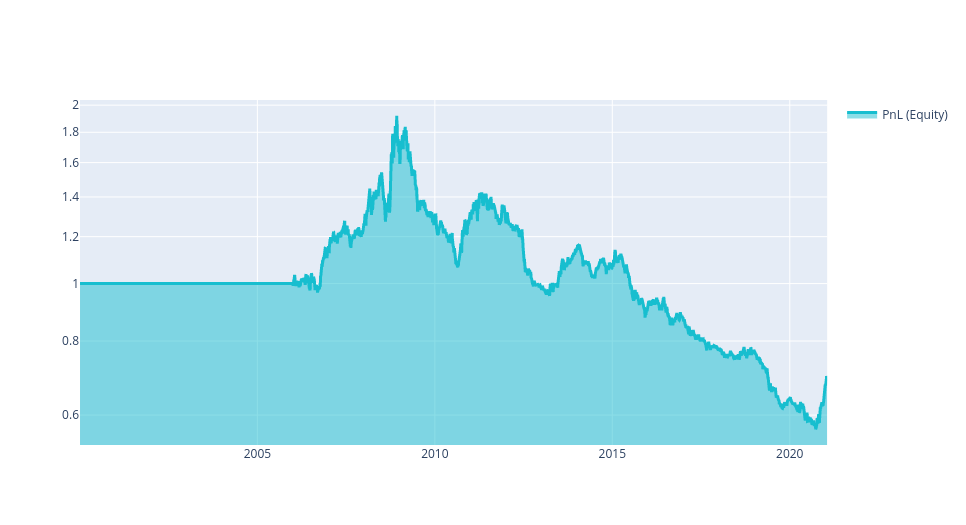
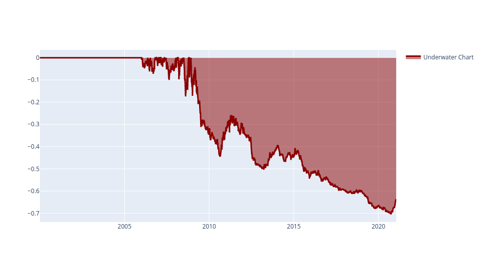

# Evaluation

## Backtesting

### Write Weights

The necessary input for backtesting is a set of allocation **weights** (fractions of capital to be invested) for all assets over the backtesting period. Let us suppose that we wrote the code:

```python
import qnt.data as qndata
import qnt.ta as qnta

futures = qndata.futures.load_data(min_date="2006-01-01")

price_open = futures.sel(field="open")
price_open_one_day_ago = qnta.shift(price_open, periods=1)

strategy = price_open - price_open_one_day_ago

weights = strategy / abs(strategy).sum("asset")
```

Then we can submit code by importing in addition the **qnt.output** library:

```python
import qnt.output as output
```

and a call to the **write** function:

```python
output.write(weights)
```


**Function**
```python
qnt.output.write(weights)
```

**Parameters**

|Parameter|Explanation|
|---|---|
|weights|xarray.DataArray with allocation weights for all assets in the backtesting period.|


**Output**

None, the call is mandatory as it will write weights to file used for evaluating performance.

### Clean Weights

We provide you with a **clean** function which can be used for performing sanity checks on the defined weights. The function can be called before writing:

```python
weights = output.clean(weights, futures, "futures")
```

It will perform 2 operations:

1. if there are trading days where the user did not specify any exposure, an exposure of “0” (no allocation) will be used;

2. if the total sum of the absolute exposure is larger than 1, normalization to 1 will be applied (i.e. max. allowed leverage is 1).

**Function**
```python
qnt.output.clean(weights, data, kind)
```

**Parameters**

|Parameter|Explanation|
|---|---|
|weights|xarray.DataArray with allocation weights for all assets in the backtesting period.|
|data|xarray.DataArray with input data.|
|kind|"futures" or "crypto".|

If kind="crypto", the code will check in addition if other futures in addition to Bitcoin are defined. In positive case, it will remove them and leave Bitcoin futures only.

**Output**

An xarray.DataArray with the cleaned weights ready for submission.

### Check Weights

In addition to the clean function we provide a **check** function which will return you warnings if issues with weights are present. The function can be called before writing:

```python
output.clean(weights, futures, "futures")
```

The first check is connected to the possible presence of missing values in your algorithm. With the previous call to the clean function, this problem is automatically solved.

The second check computes the In-Sample Sharpe ratio of your system. The In-Sample Sharpe ratio must be larger than 1 for a successful submission.

The third check controls correlation with existing templates and with all systems submitted to previous contests.

**Function**
```python
qnt.output.check(weights, data, kind)
```

**Parameters**

|Parameter|Explanation|
|---|---|
|weights|xarray.DataArray with allocation weights for all assets in the backtesting period.|
|data|xarray.DataArray with input data.|
|kind|"futures" or "crypto".|

If kind="crypto", the code will check in addition if other futures in addition to Bitcoin are defined.

**Output**

None, only warning messages will be displayed.

### Multi-Pass Backtesting

We provide you with a function for performing an optional backtesting which explicitely forbids looking-forward issues with a multi-pass implementation where at timestamp "t" only data until timestamp "t" are available by construction. It can be used with:

```python
import xarray as xr
import qnt.ta as qnta
import qnt.backtester as qnbt
import qnt.data as qndata


def load_data(period):
    return qndata.futures_load_data(
        assets=["F_AD", "F_BO", "F_BP", "F_C"],
        tail=period)


def strategy(data):
    close = data.sel(field="close")
    sma_long  = qnta.sma(close, 200).isel(time=-1)
    sma_short = qnta.sma(close,  40).isel(time=-1)
    pos = xr.where(sma_short > sma_long, 1, -1)
    return pos / abs(pos).sum("asset")


weights = qnbt.backtest(
    competition_type = "futures",
    load_data        = load_data,
    lookback_period  = 365,
    test_period      = 365 * 15,
    strategy         = strategy)
```

<p class="tip">Note that multi-pass backtesting is considerably slower than single-pass one. We suggest you to start with a simple single-pass implementation and to cross-check your results with the multi-pass implementation before submission, to get a realistic estimate of the performance of your algorithm.</p>


**Function**
```python
qnt.backtester.backtest(competition_type, load_data, lookback_period, test_period, strategy)
```

**Parameters**

|Parameter|Explanation|
|---|---|
|competition_type|"futures" or "crypto".|
|load_data|data load function which returns data time series, accepts tail argument.|
|lookback_period|calendar days, max. lookback period for building indicators.|
|test_period|calendar days, period used for the simulation.|
|strategy|strategy function, accepts data and returns weights for all assets for the last day.|

**Output**

It returns the xarray.DataArray of **weights** and performs automatically calls to **clean**, **check** and **write**.


## Statistics

### Calculating Statistics

For estimating the profitability of our algorithm we measure the Sharpe ratio, the most important and popular metric. We use the annualized Sharpe ratio and assume that there are ≈252 trading days on average per year. The annualized Sharpe ratio must be larger than 1 at submission time for the In-Sample test. The In-Sample period depends on the competition kind:

* Futures: since January 1, 2006 to submission time;
* Bitcoin Futures: since January 1, 2014 to submission time.

The **calc_stat** function allows to calculate the complete statistics of an algorithm including the Sharpe ratio.

**Function**
```python
qnt.stats.calc_stat(data, portfolio_history, slippage_factor=None, roll_slippage_factor=None,
        min_periods=1, max_periods=None)
```

**Parameters**

|Parameter|Explanation|
|---|---|
|data|xarray.DataArray with historical asset data.|
|portfolio_history|xarray.DataArray filled with allocation weights.|
|slippage_factor|fraction of ATR14 used for punishing trades. Default for futures/BTC futures is 0.04.|
|roll_slippage_factor| fraction of ATR14 used for futures rollovers. Default for futures/BTC futures is 0.02.|
|min_periods|minimal number of days used for statistics.|
|max_periods|maximal number of days used for statistics. Default None: complete time series.|

**Output**

The output is an xarray.DataArray with statistical indicators computed on a cumulative (max_periods=None) or rolling (for example, max_periods=252) basis.

|Output Field|Explanation|
|---|---|
|equity| Cumulative profit and losses. We start with 1 M USD.|
|relative_return| Relative daily variation of equity.|
|volatility| Annualized standard deviation of relative returns.|
|underwater|Time evolution of drawdowns.|
|max_drawdown|Absolute minimum of underwater.|
|sharpe_ratio|Annualized Sharpe ratio: ratio of mean return / volatility.|
|mean_return|Annualized mean return.|
|bias|Daily asymmetry between long and short exposure: 1 for a long-only system, -1 for a short-only one.|
|instruments|Number of assets which get allocations on a given day.|
|avg_turnover|Average turnover.|
|avg_holding_time|Average holding time.|

Note that some indicators are defined on a daily basis:

* equity;
* relative_return;
* underwater;
* max_drawdown;
* bias;
* instruments.

Other indicators imply an average over time:

* volatility;
* sharpe_ratio;
* mean_return;
* avg_turnover; 
* avg_holding_time.

With default arguments:

```python
qnt.stats.calc_stat(data, portfolio_history)
```
all indicators will be displayed since inception (cumulative basis).

To get results on a rolling basis, one has to specify max_periods, for example 252 trading days:
```python
qnt.stats.calc_stat(data, portfolio_history, max_periods=252)
```

To get In-Sample results one can use slicing, for example:
```python
qnt.stats.calc_stat(data, portfolio_history.sel(time=slice("2006-01-01", None)))
```


**Example**

Let us assume that you are writing a simple strategy:

```python
import xarray as xr
import qnt.ta as qnta
import qnt.data as qndata
import qnt.output as qnout
import qnt.stats as qnstats

data = qndata.futures_load_data(
    assets=["F_AD", "F_BO", "F_BP", "F_C"],
    min_date="2000-01-01")

close = data.sel(field="close")

sma_long  = qnta.sma(close, 200)
sma_short = qnta.sma(close, 40)

weights = xr.where(sma_short > sma_long, 1, -1)

weights = weights / abs(weights).sum("asset")

weights = qnout.clean(weights, data, "futures")
qnout.check(weights, data, "futures")
qnout.write(weights)
```

After the weights have been computed, you can calculate the statistics in order to evaluate the algorithm in the In-Sample perios using:

```python
stat = qnstats.calc_stat(data, weights.sel(time=slice("2006-01-01", None)))
display(stat.to_pandas().tail())
```

|field <br/> time|  equity| relative_return|    volatility| underwater| max_drawdown|   sharpe_ratio|   mean_return|    bias|   instruments|    avg_turnover|   avg_holding_time|
|---|---|---|---|---|---|---|---|---|---|---|---|
|2021-01-13 | 0.689775  |-0.000568|  0.100944|  -0.640707 |  -0.704302	 | -0.172620	 |   	-0.017425	|   1.0|    4.0| 0.018621 | 111.681818  |
|2021-01-14 | 0.698379	 | 0.012474  | 0.100971  | -0.636225	 | 	-0.704302 |  -0.166830	 | -0.016845  |1.0    |4.0  | 0.018621 |111.681818|
|2021-01-15|  0.689371|  -0.012898	 | 0.101000 |  -0.640917	 | -0.704302	 | -0.172728	 | -0.017446	  |   1.0|    4.0| 0.018622 | 111.681818  |
|2021-01-19|  0.687289| -0.003021 | 0.100993 | -0.642002	  | 	-0.704302 | -0.174101	 | -0.017583  |   1.0|    4.0|0.018620  |  111.681818 |
|2021-01-20|   0.690715	| 0.004985 | 0.100989	 |  -0.640217	 | -0.704302 |  -0.171786| -0.017349  |   1.0|    4.0| 0.018618 | 111.588235  |

We can also display plots as follows:

```python
import qnt.graph as qngraph
performance = stat.to_pandas()["equity"]
qngraph.make_plot_filled(performance.index, performance, name="PnL (Equity)", type="log")
```



```python
UWchart = stat.to_pandas()["underwater"]
qngraph.make_plot_filled(UWchart.index, UWchart, color="darkred", name="Underwater Chart", range_max=0)
```



```python
SRchart = stat.to_pandas()["sharpe_ratio"]
qngraph.make_plot_filled(SRchart.index, SRchart, color="#F442C5", name="SR")
```


