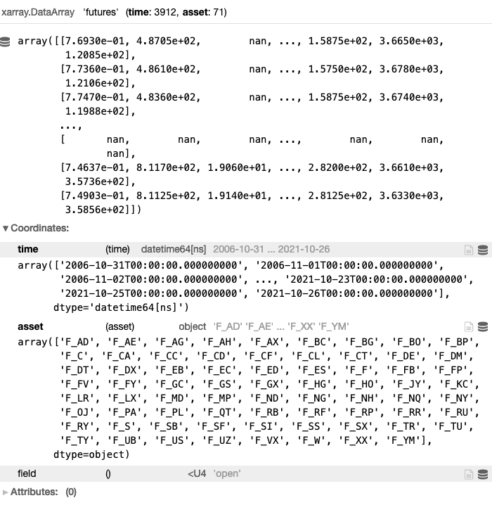
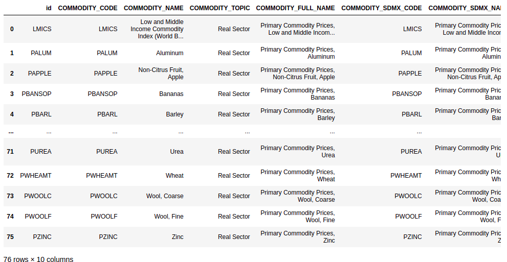
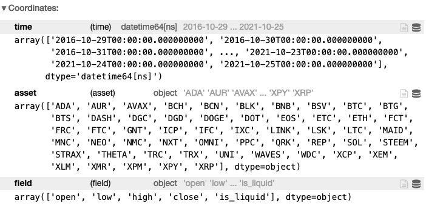
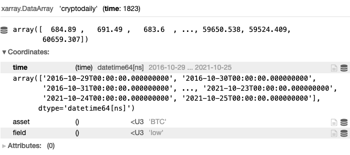
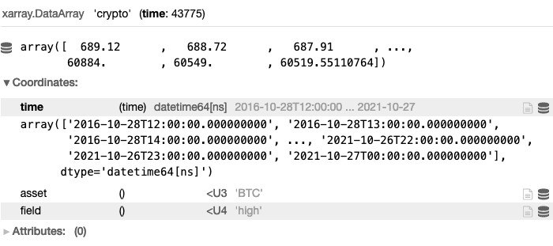

# Financial data
Quantiacs provides historical data for the world's major financial markets. Currently the dataset includes **futures** (including the Bitcoin futures) and **cryptocurrencies**. This section provides an overview of the data and a documentation for each set:

- [Futures](#futures)
- [Cryptocurrencies](#cryptocurrencies)

----

## Futures
Quantiacs provides data for 78 liquid global futures contracts. The underlying assets are commodities (energy, metals, agricultural goods) and financial assets: stock indices, bonds and currency rates. In addition it provides the Bitcoin futures contract, whose history is extended back in time by patching the futures data with the Bitcoin spot data.

###  List of Futures
The information about available futures contracts can be obtained using:

```python
import qnt.data as qndata
future_list = qndata.futures.load_list()
future_list
```

The command returns a list with all available futures contracts, with their identifying symbols and full names:
```python
[{'id': 'F_AE',
  'name': 'AEX Index',
  'sector': 'Index',
  'point_value': 'EUR 200'},
  ...,
  {'id': 'F_ES',
   'name': 'S&P 500 ETF TRUST ETF',
   'sector': 'Index',
   'point_value': '1'}]
```


###  Using the Data

Suppose that we want to use the data for the last 15 years. We can use:

```python
import qnt.data as qndata

futures_data = qndata.futures.load_data(tail = 365*15, dims = ('time', 'field', 'asset'))
futures_data
```

The variable **futures_data** is an xarray.DataArray structure whose coordinates are:

* **time**: a date in format yyyy-mm-dd;
* **asset**: the identifying symbol for the asset, for example **F_BP** for the British Pound/US Dollar ratio.
* **field**: an attribute, for example the opening daily price;


Specific fields are given by:

| Data field | Description |
| ------------------ | -------- |
| open               | Opening daily price.|
| close              | Closing daily price. |
| high               | Highest daily price.|
| low                | Lowest daily price. |
| vol                | Daily trading volume (number of contracts).|
| oi                 | Total number of outstanding contracts.|
| roll              | Futures contract rollover information.|

More details on xarray can be found at [User Guide xarray](https://quantiacs.com/documentation/en/user_guide/xarray.html)

An example of accessing the daily open prices for each asset:
```Python
futures_data.sel(field='open')
```


All specific fields can be accessed this way.


Values for **specific contracts** can be obtained selecting the asset. Let us say we are interested in British pound futures. We can get the close price as follows:

```python
GBP_USD = futures_data.sel(asset = 'F_BP').sel(field = 'close')
```

For a more detailed description on loading and accessing Futures data consult our API-Reference: [Loading Futures Data](https://quantiacs.com/documentation/en/reference/data_load_functions.html#loading-futures-data)


For visualizing the data we can use for example the plotly library [https://plotly.com/](https://plotly.com/):

```python
import plotly.graph_objs as go

trend_fig = [go.Scatter(
    x = GBP_USD.to_pandas().index,
    y = GBP_USD,
    line = dict(width=1, color='black'))]

fig = go.Figure(data = trend_fig)
fig.update_yaxes(fixedrange=False)
fig.show()
```


###  Using the BTC Futures

For a more detailed description on loading and accessing BTC Futures consult our API-Reference: [Loading BTC Futures Data](https://quantiacs.com/documentation/en/reference/data_load_functions.html#loading-bitcoin-futures-data)

The Bitcoin Futures data for the last 8 years (history extended with Bitcoin spot price) can be loaded using:

```python
import qnt.data as qndata

btc_data = qndata.cryptofutures.load_data(tail = 365*8, dims = ('time', 'field', 'asset'))
```


### Front Contracts and Different Maturity Contracts

As several Futures contracts with the same underlying instrument but different expiration dates (maturities) are traded on financial exchange at the same time, we provide the option to load continuous front contracts (closest expiration date), next-to-front contracts (next-to-closest expiration date) and next-to-next-to-front contracts (next-to-next-to-closest expiration date):

```python
front_data                 = qndata.futures.load_data(min_date='1900-01-01', offset=0)
next_to_front_data         = qndata.futures.load_data(min_date='1900-01-01', offset=1)
next_to_next_to_front_data = qndata.futures.load_data(min_date='1900-01-01', offset=2)
```
Note that the default choice (no offset specified) selects front contracts. All three options are continuous contracts, obtained by patching together the single Futures contracts.

All three continuous contracts can be used as indicators, but only the front contracts will be used for the backtesting and real trading.


### Spot Currency Data

Currency rates taken from the [International Monetary Fund](https://www.imf.org/en/Home) page can be inspected using:

```python
import pandas as pd
import qnt.data as qndata
currency_list = qndata.imf_load_currency_list()
pd.DataFrame(currency_list)
```

which returns the list for 39 time series:


Data for each time series can be loaded using (for example last 5 years):
```python
euro_currency = qndata.imf_load_currency_data(assets=['EUR'], tail=365 * 5)
```


### Spot Commodity Data

Commodity data taken from the [International Monetary Fund](https://www.imf.org/en/Home) page can be inspected using:

```python
import pandas as pd
import qnt.data as qndata
commodity_list = qndata.imf_load_commodity_list()
pd.DataFrame(commodity_list)
```

which returns the list for 76 time series:



Data for each time series can be loaded using (for example last year):
```python
gold = qndata.imf_load_commodity_data(assets=['PGOLD'], tail=365)
```
----

## Cryptocurrencies

### Cryptocurrency Daily Data
Quantiacs provides up-to-date daily data for 54 cryptocurrencies:

```python
['ADA', 'AUR', 'AVAX', 'BCH', 'BCN', 'BLK', 'BNB', 'BSV', 'BTC', 'BTG',
   'BTS', 'DASH', 'DGC', 'DGD', 'DOGE', 'DOT', 'EOS', 'ETC', 'ETH', 'FCT',
   'FRC', 'FTC', 'GNT', 'ICP', 'IFC', 'IXC', 'LINK', 'LSK', 'LTC', 'MAID',
   'MNC', 'NEO', 'NMC', 'NXT', 'OMNI', 'PPC', 'QRK', 'REP', 'SOL', 'STEEM',
   'STRAX', 'THETA', 'TRC', 'TRX', 'UNI', 'WAVES', 'WDC', 'XCP', 'XEM',
   'XLM', 'XMR', 'XPM', 'XPY', 'XRP']  
```

The available cryptocurrency data for the last 5 years can be loaded using:

```python
import qnt.data as qndata

crypto_data = qndata.cryptodaily.load_data(tail = 365 * 5)
```
For each cryptocurrency data is available on an daily resolution. **crypto_data** is an xarray.DataArray structure whose coordinates are:

* **time**: a date-time in format yyyy-mm-dd;
* **asset**: the identifying symbol for the asset, for example ETH for Ethereum.
* **field**: an attribute, for example the opening hourly price;




Specific fields are given by:

| Data field | Description |
| ------------------ | -------- |
| open               | Opening daily price.|
| close              | Closing daily price. |
| high               | Highest daily price.|
| low                | Lowest daily price. |
| is_liquid          | Is this cryptocurrency liquid? |


For a more detailed description on loading and accessing Crypto Daily data consult our API-Reference: [Loading Crypto Daily Data](https://quantiacs.com/documentation/en/reference/data_load_functions.html#loading-cryptocurrency-daily-data)


Let us say we are interested in the lowest daily price for BTC. We can extract it using:
```Python
crypto_data.sel(field = 'low').sel(asset = 'BTC')
```



### Cryptocurrency Hourly Data
Quantiacs provides up-to-date hourly data - price and volume - for the following cryptocurrencies:

* Bitcoin (BTC);
* Bitcoin Cash (BCH);
* EOS;
* Ethereum (ETH);
* Litecoin (LTC);
* Ripple (XRP);
* Tether (USDT).

The available cryptocurrency data for the last 5 years can be loaded using:
```python
import qnt.data as qndata

crypto_data = qndata.crypto.load_data(tail = 365 * 5)
```

For each cryptocurrency data are available on an hourly resolution. **crypto_data** is an xarray.DataArray structure whose coordinates are:

* **time**: a date-time in format yyyy-mm-ddTHH-MM-SS;
* **asset**: the identifying symbol for the asset, for example ETH for Ethereum;
* **field**: an attribute, for example the opening hourly price;


Specific fields are given by:

| Data field | Description |
| ------------------ | -------- |
| open               | First price in a given hour.|
| close              | Last price in a given hour. |
| high               | Highest price in a given hour. |
| low                | Lowest price in a given hour. |
| vol                | Hourly trading volume.|

Let us say we are interested in the highest hourly price for BTC. We can extract it using:

```python
BTC_high = crypto_data.sel(field = 'high').sel(asset = 'BTC')
BTC_high
```



The BTC_high data can then be visualized using:

```python
import plotly.graph_objs as go

trend_fig = [go.Scatter(
    x = BTC_high.to_pandas().index,
    y = BTC_high,
    line = dict(width=1,color='black'))]

fig = go.Figure(data = trend_fig)
fig.update_yaxes(fixedrange=False)
fig.show()
```


For a more detailed description on loading and accessing Crypto Hourly data consult our API-Reference: [Loading Crypto Hourly Data](https://quantiacs.com/documentation/en/reference/data_load_functions.html#loading-cryptocurrency-hourly-data)
