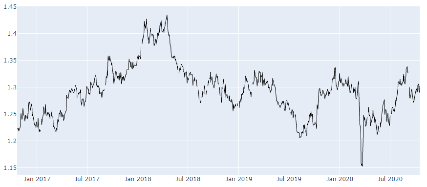

# Futures
Quantiacs provides data for 75 global futures contracts. The underlying assets are currency ratios, stock indices, bonds, and commodities from the world's futures exchanges.

##  List of futures
The information about available futures contracts can be obtained using:

```python
import qnt.data as qndata
future_list = qndata.futures.load_list()
```

For each futures, a brief information is provided:
```python
future_list
```
```python
[{'id': 'A6', 'name': 'Australian Dollar'},
 {'id': 'AE', 'name': 'Aex Index'},
 {'id': 'AH', 'name': 'Bberg Commodity Index'},
 {'id': 'B6', 'name': 'British Pound'},
 {'id': 'CB', 'name': 'Crude Oil Brent'},
 {'id': 'CC', 'name': 'Cocoa'},
 {'id': 'CF', 'name': 'Eurex Conf Long-Term'},
 {'id': 'CL', 'name': 'Crude Oil WTI'},
 {'id': 'CT', 'name': 'Cotton #2'},
 {'id': 'D6', 'name': 'Canadian Dollar'},
 {'id': 'DM', 'name': 'Mdax Index'},
 {'id': 'DX', 'name': 'U.S. Dollar Index'},
 {'id': 'DY', 'name': 'DAX Index'},
 {'id': 'E6', 'name': 'Euro FX'},
 {'id': 'ES', 'name': 'S&P 500 E-Mini'},
 {'id': 'EW', 'name': 'S&P Midcap E-Mini'},
 {'id': 'F', 'name': '3-Month Euroswiss'},
 {'id': 'FB', 'name': 'Stoxx Banks 600'},
 {'id': 'FP', 'name': 'OMX Helsinki 25'},
 {'id': 'FS', 'name': 'Stoxx 50'},
 {'id': 'FY', 'name': 'Stoxx Europe 600'},
 {'id': 'G', 'name': '10-Year Long Gilt'},
 {'id': 'GC', 'name': 'Gold'},
 {'id': 'GE', 'name': 'Eurodollar'},
 {'id': 'GF', 'name': 'Feeder Cattle'},
 {'id': 'GG', 'name': 'Euro Bund'},
 {'id': 'GX', 'name': 'Euro Buxl'},
 {'id': 'HE', 'name': 'Lean Hogs'},
 {'id': 'HF', 'name': 'Euro Schatz'},
 {'id': 'HG', 'name': 'High Grade Copper'},
 {'id': 'HR', 'name': 'Euro Bobl'},
 {'id': 'J6', 'name': 'Japanese Yen'},
 {'id': 'KC', 'name': 'Coffee'},
 {'id': 'L', 'name': '3-Month Sterling'},
 {'id': 'L6', 'name': 'Brazilian Real'},
 {'id': 'LE', 'name': 'Live Cattle'},
 {'id': 'LF', 'name': 'ICE Gas Oil LS'},
 {'id': 'LO', 'name': 'ICE Heating Oil'},
 {'id': 'LS', 'name': 'Lumber'},
 {'id': 'M6', 'name': 'Mexican Peso'},
 {'id': 'MX', 'name': 'CAC 40'},
 {'id': 'N6', 'name': 'New Zealand Dollar'},
 {'id': 'NG', 'name': 'Natural Gas'},
 {'id': 'NQ', 'name': 'Nasdaq 100 E-Mini'},
 {'id': 'NY', 'name': 'Nikkei 225'},
 {'id': 'OJ', 'name': 'Orange Juice'},
 {'id': 'PA', 'name': 'Palladium'},
 {'id': 'PL', 'name': 'Platinum'},
 {'id': 'QR', 'name': 'Russell 2000 E-Mini'},
 {'id': 'R6', 'name': 'Russian Ruble'},
 {'id': 'RB', 'name': 'Gasoline RBOB'},
 {'id': 'RF', 'name': 'Euro/Swiss'},
 {'id': 'RP', 'name': 'Euro/Pound'},
 {'id': 'RY', 'name': 'Euro/Yen'},
 {'id': 'S6', 'name': 'Swiss Franc'},
 {'id': 'SB', 'name': 'Sugar #11'},
 {'id': 'SI', 'name': 'Silver'},
 {'id': 'SZ', 'name': 'Swiss Market Index'},
 {'id': 'T6', 'name': 'South African Rand'},
 {'id': 'TV', 'name': 'Eurex 3Month EuriBor'},
 {'id': 'VI', 'name': 'S&P 500 VIX'},
 {'id': 'X', 'name': 'FTSE 100'},
 {'id': 'YM', 'name': 'Dow Futures Mini'},
 {'id': 'ZB', 'name': 'T-Bond'},
 {'id': 'ZC', 'name': 'Corn'},
 {'id': 'ZF', 'name': '5-Year T-Note'},
 {'id': 'ZL', 'name': 'Soybean Oil'},
 {'id': 'ZM', 'name': 'Soybean Meal'},
 {'id': 'ZN', 'name': '10-Year T-Note'},
 {'id': 'ZO', 'name': 'Oats'},
 {'id': 'ZQ', 'name': '30-Day Fed Funds'},
 {'id': 'ZR', 'name': 'Rough Rice'},
 {'id': 'ZS', 'name': 'Soybean'},
 {'id': 'ZT', 'name': '2-Year T-Note'},
 {'id': 'ZW', 'name': 'Wheat'}]
```

##  Downloading the data

Suppose that we want to download the data for the last 5 years. We can use:

```python
import qnt.data as qndata

futures_data = qndata.futures.load_data(tail = 365*5, dims = ("time", "field", "asset"))

futures_open = futures_data.sel(field="open")
futures_close = futures_data.sel(field="close")
futures_high = futures_data.sel(field="high")
futures_low = futures_data.sel(field="low")
volume_day = futures_data.sel(field="vol")
open_interest = futures_data.sel(field="oi")
contracts_roll_over = futures_data.sel(field="roll")
```

| Data field | Description |
| ------------------ | -------- |
| open               | Opening daily price.|
| close              | Closing daily price. |
| high               | Highest daily price.|
| low                | Lowest daily price. |
| vol                | Daily trading volume in number of contracts.|
| oi                 | The total number of outstanding contracts.|
| roll              | Futures contracts rollover information.|

Let us say that we are interested in British pound futures. We can get the close price as follows:

```python
GBP_USD = futures_data.sel(asset = 'F_BP').sel(field = 'close')
```

For visualizing the data we can use:

```python
import plotly.graph_objs as go         # lib for charts
trend_fig = [
    go.Scatter(
        x = GBP_USD.to_pandas().index,
        y = GBP_USD,
        line = dict(width=1,color='black'))]

# draw chart
fig = go.Figure(data = trend_fig)
fig.update_yaxes(fixedrange=False) # unlock vertical scrolling
fig.show()
```


