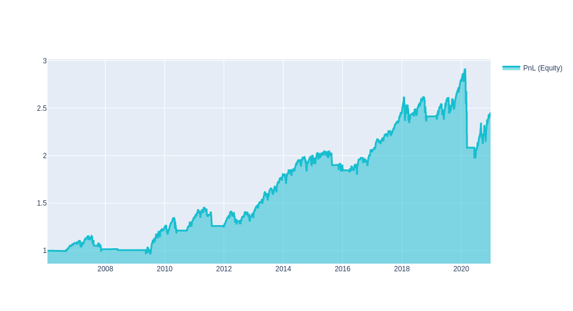

# Algorithm quality

Once we have developed an algorithm we can have an idea of its performance by a visual inspection of the equity chart.

Let us consider a simple long-only strategy on the S&P500 index Futures: we go long once the simple-moving-average of the close price over the last 20 days is larger than the simple-moving-average of the close price over the last 150 days.

```python
import xarray as xr

import qnt.ta as qnta
import qnt.data as qndata
import qnt.output as qnout

data = qndata.futures_load_data(tail=365 * 15, assets= ["F_ES"])

close = data.sel(field="close")

sma150 = qnta.sma(close, 150)
sma20  = qnta.sma(close, 20)

weights = xr.where(sma150 < sma20, 1, 0)

weights = weights / abs(weights).sum("asset")

weights = qnout.clean(weights, data, "futures")

qnout.check(weights, data, "futures")

qnout.write(weights)
```

We can plot the equity chart on historical data by adding:

```python
import qnt.stats as qnstats
import qnt.graph as qngraph
statistics = qnstats.calc_stat(data, weights)
performance = statistics.to_pandas()["equity"]
qngraph.make_plot_filled(performance.index, performance, name="PnL (Equity)")
```



Key statistical indicators can be obtained by calling the **calc_stat** function. Some indicators are defined on a daily basis:

* **equity**: the cumulative value of profits and losses since inception (1M USD);
* **relative_return**: the relative daily variation of **equity**;
* **underwater**: the time evolution of drawdowns;
* **max_drawdown**: the absolute minimum of the underwater chart;
* **bias**: the daily asymmetry between long and short exposure: 1 for a long-only system, -1 for a short-only one;
* **instruments**: the number of instruments which get allocations on a given day.

Other indicators imply an average over time:

* **volatility**: the volatility of the investment since inception (i.e. the annualized standard deviation of the daily returns);
* **sharpe_ratio**: the annualized Sharpe ratio since inception; the value must be larger than 1 for taking part to contests;
* **mean_return**: the annualized mean return of the investment since inception;
* **avg_turnover**: the average turnover;
* **avg_holding_time**: the average holding time in days.

The **calc_stat** function can be called in 3 different ways which affect the lookback periods for averages:

* default arguments: 
```python
statistics = qnstats.calc_stat(data, weights)
```
The results will be displayed on a cumulative basis, i.e. they will include all data since the beginning of the time series **data**.

* specifying a pre-defined window (for example, the last year):
```python
statistics = qnstats.calc_stat(data, weights, max_period=252)
```
The results will be displayed on a rolling basis, i.e. they will include all last 252 points in **data**.

* specifying the beginning of the in-sample period:
```python
in_sample_slice = weights.sel(time=slice("2006-01-01", None))
statistics = qnstats.calc_stat(data, in_sample_slice)
```

Results can be displayed calling:
```python
display(statistics.to_pandas().tail())
```


Please note that a **submission** needs to have an In-Sample Sharpe ratio **larger than 1!**


