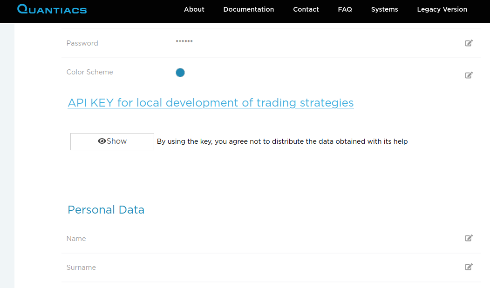

# Local development of trading strategies

You can use the Quantiacs library (QNT) for developing locally trading strategies on your computer.

You can follow these easy steps and create an isolated environment on your machine using **conda** for managing dependencies and avoiding conflicts:

1. Install Anaconda from https://www.anaconda.com/products/individual or https://repo.anaconda.com/archive/.
2. Create an isolated environment for developing strategies and install the QNT library together with needed dependencies:
    ```bash
    conda create -n qntdev quantiacs-source::qnt conda-forge::ta-lib conda-forge::dash=1.18 python=3.7
    ```
3. Set your API key. You can find it in your profile on your personal Quantiacs area.

   

    ```bash
    conda env config vars set -n qntdev API_KEY={your_api_key_here}
    ```

4. Activate your environment if not yet activated:
   ```bash
   conda activate qntdev
   ```
   For leaving the environment:
   ```bash
   conda deactivate
   ```
   Each time you want to use the QNT library, reactivate the environment.


5. Develop your strategy using the IDE you like. A good starting point is represented by the following **strategy.py** file:

   ```python
   import qnt.ta as qnta
   import qnt.data as qndata
   import qnt.backtester as qnbk
   
   import xarray as xr
   
   
   def load_data(period):
       data = qndata.futures_load_data(tail=period)
       return data
   
   
   def strategy(data):
       close = data.sel(field='close')
       sma200 = qnta.sma(close, 200).isel(time=-1)
       sma20 = qnta.sma(close, 20).isel(time=-1)
       return xr.where(sma200 < sma20, 1, -1)
   
   
   qnbk.backtest(
       competition_type="futures",
       load_data=load_data,
       lookback_period=365,
       test_period=2*365,
       strategy=strategy
   )
   ```

6. Use this command to run your strategy (replace **python** with **python3** if your default python version is 2):
   ```bash
    python strategy.py
   ```

7. When you finish with developing your strategy, you need to upload 
your code the Jupyter Notebook environment on the Quantiacs webpage.

There are 2 options:

a) Copy and paste your code inside the cell of a Jupyter Notebook;

b) Upload your python file (for example, **strategy.py**) in your Jupyter environment root directory and type in **strategy.ipynb**:

   ```python
   import strategy
   ```

8. Run all cells to test your strategy in the Jupyter Notebook. Fix the errors if it is necessary. It is a good idea to run the file **precheck.ipynb**. 

9. Send your strategy to the Contest from the **Development** area on your home page by clicking on the **Submit** button.

10. Wait for your strategy to pass contest filters and take part to the Contest.
