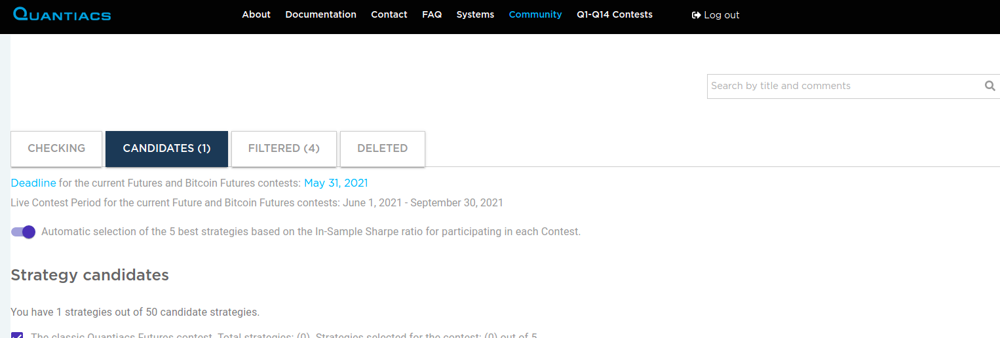

# Competition filters

For submitting a strategy to a contest you have to click on the **Submit** button:

   
After submission your code will be checked on our servers and its status will appear in the **Competition** section of your account under the tab **Checking**:

Your algorithm will be admitted to the Contest if it passes checks (filters). In case of success you will find your code under the **Running** tab. Otherwise it will be listed under the **Filtered** tab where you will be able to inspect the logs and determine the reason for the error.

## Technical filters

### strategy.ipynb
If you see the message "strategy.ipynb was not found", then please check the name of the main strategy file, it should be named **strategy.ipynb**.

### Timeout
The strategy calculation should not exceed a given time. If you see the message "Calculation time exceeded", then you need to optimize the code and reduce the execution time. Futures systems should be evaluated in 10 minutes, bitcoin futures systems in 5 minutes and equity systems in 30 minutes.

### strategy.ipynb compilation
If you see the message "strategy.ipynb does not compile", then most likely an error occurred while calculating the strategy.

- Be sure to check the logs, normally they will provide the necessary information.

- Pay also attention to the reference date in the logs. You can use it to reproduce the bug in **precheck.ipynb**. (Substitute this date in the **dates** array when calling **evaluate_passes**.)

### Write_output
If you see the message "The call to the write_output function is skipped", then your strategy does not save the result of calculations.
I.е. the call of **write_output** is skipped. Add this call to the end of the **strategy.ipynb** file.

### last data
If you see the message "Data is loaded only until a certain day", then in your template the data is loaded with the specified **max_date** parameter. Remove it.

### Number of strategies
If you see the message "Strategy limit exceeded", it means that you have submitted too many strategies. You can have at most 50 strategies in your area.

### output dates
If you see the message "The strategy does not display weights for all trading days", it means that some days are missing in the output of your strategy.
Check if you are using a drop operation on the time axis.

## Sharpe ratio
If you see a message informaing you that the Sharpe ratio is smaller than 1, it means that the performance of your strategy in the in-sample period is too small and the Sharpe ratio should be improved.
