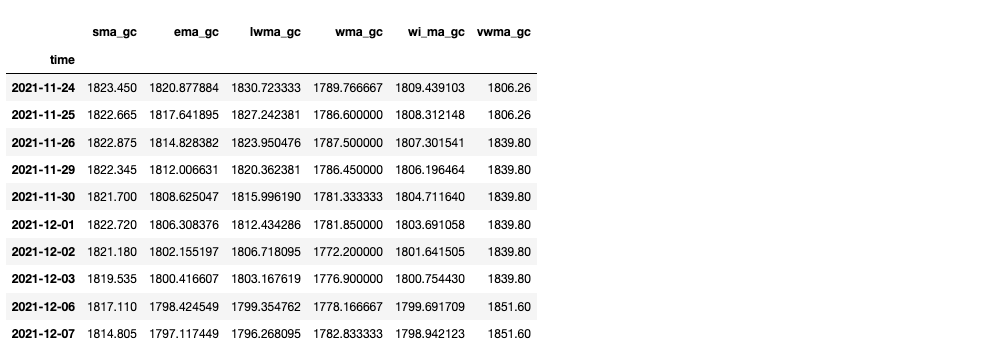

# Technical Indicators

Technical indicators are heuristic or pattern-based signals produced by the price, volume, etc. of a security or a cryptocurrency.

First we need to load some data and import the library which holds all the technical indicators we provide:
```Python
import qnt.ta as qnta
import qnt.data as qndata

data = qndata.futures.load_data(tail=365)

high = data.sel(field='high')
low = data.sel(field='low')
close = data.sel(field='close')
volume = data.sel(field='vol')

```

## Moving Averages
A moving average is a calculation used to analyze data points by creating a series of averages of different subsets of the full data set.


### Simple Moving Average (SMA)

A simple moving average (SMA) is a calculation that takes the arithmetic mean of a given set of prices over the specific number of days (20 in this example) in the past.

```Python
sma = qnta.sma(close,20)
```

### Exponential Moving Average (EMA)


```Python
ema = qnta.ema(close, 20)
```

### Linearly Weighted Moving Average (LWMA)

```Python
lwma = qnta.lwma(close, 20)
```

### Weigthed Moving Average (WMA)

with the **wma** method you have to define your own weights for each period.
```Python
weights = [3,2,1]
wma = qnta.wma(close,weights)
```

### Wilder Moving Average (Wilder MA)

```Python
wi_ma = qnta.wilder_ma(close,20)
```

### Volume Weighted Moving Average (VWMA)

```Python
vwma = qnta.vwma(close, volume, 20)
```

### Comparison
Here is an example comparison of all moving averages for F_GC.

```Python
sma_gc = sma.sel(asset='F_GC').to_pandas()
ema_gc = ema.sel(asset='F_GC').to_pandas()
lwma_gc = lwma.sel(asset='F_GC').to_pandas()

wma_gc = wma.sel(asset='F_GC').to_pandas()
wi_ma_gc = wi_ma.sel(asset='F_GC').to_pandas()
vwma_gc = vwma.sel(asset='F_GC').to_pandas()


import pandas as pd
moving_averages = pd.concat([sma_gc,ema_gc,lwma_gc,wma_gc,wi_ma_gc,vwma_gc],axis=1)
moving_averages.set_axis(['sma_gc', 'ema_gc', 'lwma_gc', 'wma_gc', 'wi_ma_gc','vwma_gc'], axis=1).tail(10)
```



## Oscillators

### Stochastic Oscillator

A stochastic oscillator is a momentum indicator comparing a particular closing price of a security to a range of its prices over a certain period of time. To learn more go to [Stochastic Oscillator](https://en.wikipedia.org/wiki/Stochastic_oscillator)

You can get the **fast stochastic indicator** or **k** with:
```Python
stoch_k = qnta.stochastic_k(high, low, close, 14)
```
To get **k** and **d** for both, the **fast** and **slow** stochastic indicator:
```Python
stoch_fast_k, stoch_fast_d = qnta.stochastic(high, low, close, 14)
stoch_slow_k, stoch_slow_d = qnta.slow_stochastic(high, low, close, 14)
```

### Momentum Indicators

Momentum indicators are tools used to determine the strength or weakness of a stock's price. Momentum measures the rate of the rise or fall of prices. To learn more about momentum indicators, visit [Momentum](https://en.wikipedia.org/wiki/Momentum_(technical_analysis)), [MACD](https://en.wikipedia.org/wiki/MACD) and [RSI](https://en.wikipedia.org/wiki/Relative_strength_index)

```Python
rsi = qnta.rsi(close, 14) # Relative Strength Index
roc = qnta.roc(close, 7) # Rate-of-Change indicator
sroc = qnta.sroc(close, 13, 21) # Smoothed Rate-of-Change indicator
macd_line, macd_signal_line, macd_hist = qnta.macd(close, 12, 26, 9) # Moving Average Convergence Divergence
trix = qnta.trix(close, 18) #  triple exponential average indicator
```

## Directional Indicators
For more infos about directional indicators visit [Average Directional Index](https://en.wikipedia.org/wiki/Average_directional_movement_index), [Average True Range](https://en.wikipedia.org/wiki/Average_true_range) and [Advance/Decline](https://en.wikipedia.org/wiki/Advance%E2%80%93decline_line).
```Python
atr = qnta.atr(high, low, close, 14) #Average True Range
plus_di, minus_di, adx, adxr = qnta.dms(high, low, close, 14, 20, 7) #Average Directional Index

ad_line = qnta.ad_line(close) # Advance/Decline Line
ad_ratio = qnta.ad_ratio(close) # Advance/Decline Ratio

```

## Cumulative Indicators
```Python
obv = qnta.obv(close, volume) # On-Balance Volume

chaikin_adl = qnta.chaikin_adl(high, low, close, volume) # accumulation-distribution line
chaikin_osc = qnta.chaikin_osc(chaikin_adl, 3, 10) # Chaikin Oscillator
```

## Other Indicators

```Python
pivot_points = qnta.pivot_points(close, 20, 20) # Pivot Point
top_pivot_points = qnta.top_pivot_points(close, 20)
bottom_pivot_points = qnta.bottom_pivot_points(close, 20)

change = qnta.change(close, 1) # price - shifted
shift = qnta.shift(close, 1)

std = qnta.std(close) # Standard deviation

variance = qnta.variance(close, 20)
asset1, asset2 = close.sel(asset='F_GC'), close.sel(asset='F_DX')
covariance = qnta.covariance(asset1, asset2, 20)
beta = qnta.beta(asset1, asset2, 20) # Beta Value
correlation = qnta.correlation(asset1, asset2, 20)
```
